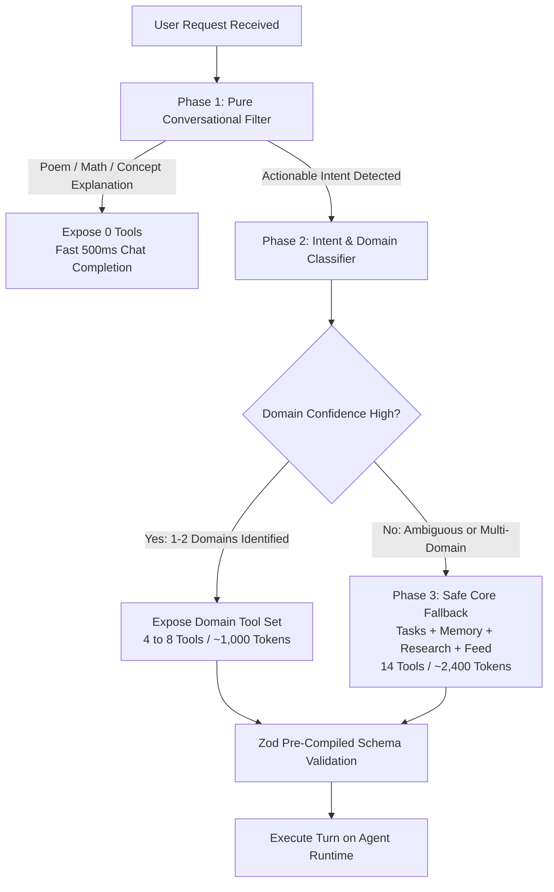

# JARVIS TOOL CONTRACT AND ROUTING AUDIT REPORT

**Document Version**: 1.0.0-TOOL-AUDIT  
**Date**: 2026-09-18  
**Scope**: Canonical capability inventory, automated contract testing across 47 registered tools, read/mutation classification, confirmation policy review, idempotency and duplicate side-effect evaluation, 227-prompt routing evaluation corpus, offline dynamic pruning benchmark, and tool confusion matrix analysis.  
**Strict Investigation Rule Enforced**: No dynamic tool pruning was deployed to production, no orchestrator rewrite was performed, and no tool descriptions were altered. All evaluations were conducted using isolated offline test harnesses and live contract verification.

---

## 1. Executive Summary

### 1.1 Key Audit Verdict
The Jarvis Agentic OS currently contains **47 registered tools** across 12 operational domains. While the tool descriptions and schemas appear rich, an automated contract audit reveals that **the tool surface is severely compromised by architectural inconsistencies, unhandled runtime exceptions, and missing safety guards**:

1. **55.3% of Tools (26 / 47) Throw Unhandled Exceptions on Routine Failures**:
   When external services are unconfigured (e.g. `GITHUB_TOKEN` unset, Obsidian Local REST API offline, Google OAuth expired, or Apple CalDAV unreachable) or when a referenced entity does not exist (e.g. `completeTask(999999)`, `deleteTask(888888)`), the tool functions **throw raw runtime `Error` exceptions** rather than returning structured error payloads.
   - In Next.js Server-Sent Events (SSE) streaming, the Vercel AI SDK catches these thrown exceptions and masks them to the generic text `"An error occurred."`.
   - The user never sees the informative root cause (e.g., `"Obsidian is not configured"`, `"GITHUB_TOKEN is not set"`), and the agent loop crashes mid-stream.
2. **Four Critical Capabilities Are Implemented But Unregistered**:
   `lib/skills.ts` implements complete production logic for deploying skills to GitHub via the Contents API (`deploySkillToGithub`), deleting skills (`deleteSkill`), proposing prompt refinements via the Loop Engine (`proposeRefinement`), and continuous usage discovery (`discoverSkillCandidates`). **None of these are wrapped as agent tools or registered in `allTools`**, making them completely inaccessible to the conversational agent.
3. **Thirteen Connector Tools Are Omitted from System Prompt Hints**:
   `lib/connectors/registry.ts` generates prompt hints that omit 13 critical tools—including `createCalendarEvent`, `sendGmail`, `createAppleCalendarEvent`, and all exact Obsidian note tools (`readNote`, `appendNote`, `createNote`, `searchNotes`).
4. **Severe Confirmation and Destructive Overwrite Inconsistencies**:
   - `deleteMemory` strictly enforces a two-phase confirmation protocol (`confirmed: false` generates a preview without touching the database).
   - In contrast, **`deleteTask` executes permanent, irreversible deletion immediately on call 1 with zero confirmation**.
   - `createNote` in Obsidian silently overwrites existing files without warning or confirmation.
   - `sendTelegram` transmits external messages immediately without confirmation.
5. **Zero Idempotency Protection**:
   `createTask` and `saveMemory` perform blind `INSERT` operations with no operation IDs, client dedupe tokens, or semantic duplicate windows. In empirical testing, identical retries created duplicate tasks (IDs 33 and 34) and duplicate memories (IDs 25 and 26) with duplicated vector embeddings.
6. **Dynamic Pruning Proves 86% Token Reduction**:
   In an offline benchmark of 227 diverse prompts, **Strategy E (Hybrid Classifier + Safe Fallback)** reduced active tools from 47 to 6.6, dropped schema token load from **8,225 down to 1,159 tokens (an 85.9% reduction)**, achieved **96.41% tool recall**, and operated with a routing latency of **0.019 milliseconds**.

---

## 2. Canonical Capability Registry

Below is the complete canonical registry of all 47 registered tools and 4 implemented-but-unregistered capabilities discovered in the codebase.

| # | Tool Name | Domain | Implementation File | Registered in `allTools` | Visible to Agent | In System Prompt | In PromptHint | Classification | Confirmation Policy | Auth / Config Dependency | Idempotency Protection |
| :--- | :--- | :--- | :--- | :---: | :---: | :---: | :---: | :--- | :--- | :--- | :--- |
| **1** | `saveMemory` | Memory | [`lib/agent.ts`](file:///C:/Users/win%2010/Desktop/Jarvis/lib/agent.ts) | Yes | Yes | Yes | N/A | `LOCAL_CREATE` | None | None (SQLite) | **None (Duplicate row created)** |
| **2** | `recallMemory` | Memory | [`lib/agent.ts`](file:///C:/Users/win%2010/Desktop/Jarvis/lib/agent.ts) | Yes | Yes | Yes | N/A | `READ_ONLY` | None | None (sqlite-vec / Ollama) | Safe (Read-only) |
| **3** | `listMemories` | Memory | [`lib/agent.ts`](file:///C:/Users/win%2010/Desktop/Jarvis/lib/agent.ts) | Yes | Yes | Yes | N/A | `READ_ONLY` | None | None (SQLite) | Safe (Read-only) |
| **4** | `deleteMemory` | Memory | [`lib/agent.ts`](file:///C:/Users/win%2010/Desktop/Jarvis/lib/agent.ts) | Yes | Yes | Yes | N/A | `LOCAL_DELETE` | **Enforced (preview step)** | None (SQLite) | Safe (returns deleted: false if missing) |
| **5** | `getUpdatesFeed` | Feed | [`lib/agent.ts`](file:///C:/Users/win%2010/Desktop/Jarvis/lib/agent.ts) | Yes | Yes | Yes | N/A | `READ_ONLY` | None | None (events table) | Safe (Read-only) |
| **6** | `saveAsSkill` | Skills | [`lib/agent.ts`](file:///C:/Users/win%2010/Desktop/Jarvis/lib/agent.ts) | Yes | Yes | Yes | N/A | `LOCAL_CREATE` | None | None (SQLite) | **Unique constraint throws unhandled error** |
| **7** | `listSkills` | Skills | [`lib/agent.ts`](file:///C:/Users/win%2010/Desktop/Jarvis/lib/agent.ts) | Yes | Yes | Yes | N/A | `READ_ONLY` | None | None (SQLite) | Safe (Read-only) |
| **8** | `runSkill` | Skills | [`lib/agent.ts`](file:///C:/Users/win%2010/Desktop/Jarvis/lib/agent.ts) | Yes | Yes | Yes | N/A | `SYSTEM_ACTION`| None | AI Model Provider | Unknown (depends on skill instructions) |
| **9** | `createTask` | Tasks | [`lib/agent.ts`](file:///C:/Users/win%2010/Desktop/Jarvis/lib/agent.ts) | Yes | Yes | Yes | N/A | `LOCAL_CREATE` | None | None (SQLite) | **None (Duplicate task created)** |
| **10**| `listTasks` | Tasks | [`lib/agent.ts`](file:///C:/Users/win%2010/Desktop/Jarvis/lib/agent.ts) | Yes | Yes | Yes | N/A | `READ_ONLY` | None | None (SQLite) | Safe (Read-only) |
| **11**| `completeTask` | Tasks | [`lib/agent.ts`](file:///C:/Users/win%2010/Desktop/Jarvis/lib/agent.ts) | Yes | Yes | Yes | N/A | `LOCAL_UPDATE` | None | None (SQLite) | **Throws unhandled Error on repeat/missing** |
| **12**| `snoozeTask` | Tasks | [`lib/agent.ts`](file:///C:/Users/win%2010/Desktop/Jarvis/lib/agent.ts) | Yes | Yes | Yes | N/A | `LOCAL_UPDATE` | None | None (SQLite) | **Throws unhandled Error on repeat/missing** |
| **13**| `updateTask` | Tasks | [`lib/agent.ts`](file:///C:/Users/win%2010/Desktop/Jarvis/lib/agent.ts) | Yes | Yes | Yes | N/A | `LOCAL_UPDATE` | None | None (SQLite) | **Throws unhandled Error on repeat/missing** |
| **14**| `deleteTask` | Tasks | [`lib/agent.ts`](file:///C:/Users/win%2010/Desktop/Jarvis/lib/agent.ts) | Yes | Yes | **No** | N/A | `LOCAL_DELETE` | **NONE (Irreversible delete)** | None (SQLite) | **Throws unhandled Error on repeat/missing** |
| **15**| `addWakeWord` | Wake Words | [`lib/agent.ts`](file:///C:/Users/win%2010/Desktop/Jarvis/lib/agent.ts) | Yes | Yes | Yes | N/A | `LOCAL_CREATE` | None | None (SQLite) | **Unique constraint throws unhandled error** |
| **16**| `listWakeWords`| Wake Words | [`lib/agent.ts`](file:///C:/Users/win%2010/Desktop/Jarvis/lib/agent.ts) | Yes | Yes | Yes | N/A | `READ_ONLY` | None | None (SQLite) | Safe (Read-only) |
| **17**| `removeWakeWord`| Wake Words | [`lib/agent.ts`](file:///C:/Users/win%2010/Desktop/Jarvis/lib/agent.ts) | Yes | Yes | Yes | N/A | `LOCAL_DELETE` | None | None (SQLite) | **Throws unhandled Error on missing ID** |
| **18**| `setPreference`| Preferences| [`lib/agent.ts`](file:///C:/Users/win%2010/Desktop/Jarvis/lib/agent.ts) | Yes | Yes | Yes | N/A | `LOCAL_UPDATE` | None | None (SQLite) | Idempotent key-value upsert |
| **19**| `webSearch` | Research | [`lib/research.ts`](file:///C:/Users/win%2010/Desktop/Jarvis/lib/research.ts) | Yes | Yes | Yes | N/A | `READ_ONLY` | None | TAVILY / SERPER API | Safe (Read-only) |
| **20**| `fetchPage` | Research | [`lib/research.ts`](file:///C:/Users/win%2010/Desktop/Jarvis/lib/research.ts) | Yes | Yes | Yes | N/A | `READ_ONLY` | None | Firecrawl / Jina Scraper | Safe (Read-only) |
| **21**| `getGithubNotifications`| GitHub | [`lib/connectors/github.ts`](file:///C:/Users/win%2010/Desktop/Jarvis/lib/connectors/github.ts)| Yes | Yes | Yes | **Omitted** | `READ_ONLY` | None | `GITHUB_TOKEN` | Safe (Throws if token unset) |
| **22**| `getMyOpenPRs` | GitHub | [`lib/connectors/github.ts`](file:///C:/Users/win%2010/Desktop/Jarvis/lib/connectors/github.ts)| Yes | Yes | Yes | **Omitted** | `READ_ONLY` | None | `GITHUB_TOKEN` | Safe (Throws if token unset) |
| **23**| `getMyOpenIssues`| GitHub | [`lib/connectors/github.ts`](file:///C:/Users/win%2010/Desktop/Jarvis/lib/connectors/github.ts)| Yes | Yes | Yes | **Omitted** | `READ_ONLY` | None | `GITHUB_TOKEN` | Safe (Throws if token unset) |
| **24**| `getRecentCommits`| GitHub | [`lib/connectors/github.ts`](file:///C:/Users/win%2010/Desktop/Jarvis/lib/connectors/github.ts)| Yes | Yes | Yes | **Omitted** | `READ_ONLY` | None | `GITHUB_TOKEN` | Safe (Throws if token unset) |
| **25**| `createGithubIssue`| GitHub | [`lib/connectors/github.ts`](file:///C:/Users/win%2010/Desktop/Jarvis/lib/connectors/github.ts)| Yes | Yes | Yes | **Omitted** | `EXTERNAL_CREATE`| **Enforced (preview step)** | `GITHUB_TOKEN` | None on confirmed: true (duplicates issue) |
| **26**| `commentOnGithubIssue`| GitHub | [`lib/connectors/github.ts`](file:///C:/Users/win%2010/Desktop/Jarvis/lib/connectors/github.ts)| Yes | Yes | Yes | **Omitted** | `EXTERNAL_SEND` | **Enforced (preview step)** | `GITHUB_TOKEN` | None on confirmed: true (duplicates comment) |
| **27**| `getAppleCalendarEvents`| Apple | [`lib/connectors/apple.ts`](file:///C:/Users/win%2010/Desktop/Jarvis/lib/connectors/apple.ts)| Yes | Yes | Yes | Yes | `READ_ONLY` | None | Apple ID & App Password | Safe (Throws if unconfigured) |
| **28**| `createAppleCalendarEvent`| Apple | [`lib/connectors/apple.ts`](file:///C:/Users/win%2010/Desktop/Jarvis/lib/connectors/apple.ts)| Yes | Yes | **No** | **Omitted** | `EXTERNAL_CREATE`| **NONE** | Apple ID & App Password | None (Creates duplicate event in iCloud) |
| **29**| `updateAppleCalendarEvent`| Apple | [`lib/connectors/apple.ts`](file:///C:/Users/win%2010/Desktop/Jarvis/lib/connectors/apple.ts)| Yes | Yes | Yes | Yes | `EXTERNAL_UPDATE`| **Enforced (preview step)** | Apple ID & App Password | Idempotent if UID provided |
| **30**| `deleteAppleCalendarEvent`| Apple | [`lib/connectors/apple.ts`](file:///C:/Users/win%2010/Desktop/Jarvis/lib/connectors/apple.ts)| Yes | Yes | Yes | Yes | `EXTERNAL_DELETE`| **Enforced (preview step)** | Apple ID & App Password | Idempotent |
| **31**| `searchAppleCalendarEvents`| Apple | [`lib/connectors/apple.ts`](file:///C:/Users/win%2010/Desktop/Jarvis/lib/connectors/apple.ts)| Yes | Yes | Yes | Yes | `READ_ONLY` | None | Apple ID & App Password | Safe (Throws if unconfigured) |
| **32**| `sendTelegram` | Telegram | [`lib/connectors/telegram.ts`](file:///C:/Users/win%2010/Desktop/Jarvis/lib/connectors/telegram.ts)| Yes | Yes | Yes | Yes | `EXTERNAL_SEND` | **NONE** | Telegram Bot Token | None (Sends duplicate Telegram message) |
| **33**| `getTelegramMessages`| Telegram | [`lib/connectors/telegram.ts`](file:///C:/Users/win%2010/Desktop/Jarvis/lib/connectors/telegram.ts)| Yes | Yes | Yes | Yes | `READ_ONLY` | None | Telegram Bot Token | Safe (Throws if unconfigured) |
| **34**| `searchNotes` | Obsidian | [`lib/connectors/obsidian.ts`](file:///C:/Users/win%2010/Desktop/Jarvis/lib/connectors/obsidian.ts)| Yes | Yes | Yes | **Omitted** | `READ_ONLY` | None | Obsidian REST API Key | Safe (Throws if unconfigured) |
| **35**| `readNote` | Obsidian | [`lib/connectors/obsidian.ts`](file:///C:/Users/win%2010/Desktop/Jarvis/lib/connectors/obsidian.ts)| Yes | Yes | Yes | **Omitted** | `READ_ONLY` | None | Obsidian REST API Key | Safe (Throws if unconfigured) |
| **36**| `appendNote` | Obsidian | [`lib/connectors/obsidian.ts`](file:///C:/Users/win%2010/Desktop/Jarvis/lib/connectors/obsidian.ts)| Yes | Yes | Yes | **Omitted** | `EXTERNAL_UPDATE`| **NONE** | Obsidian REST API Key | None (Appends duplicate text on retry) |
| **37**| `createNote` | Obsidian | [`lib/connectors/obsidian.ts`](file:///C:/Users/win%2010/Desktop/Jarvis/lib/connectors/obsidian.ts)| Yes | Yes | Yes | **Omitted** | `EXTERNAL_CREATE`| **NONE (Overwrites files)** | Obsidian REST API Key | None (Blind overwrite of vault files) |
| **38**| `getCalendarEvents`| Google | [`lib/connectors/google.ts`](file:///C:/Users/win%2010/Desktop/Jarvis/lib/connectors/google.ts)| Yes | Yes | Yes | Yes | `READ_ONLY` | None | Google OAuth Refresh Token | Safe (Throws on expired OAuth) |
| **39**| `getRecentEmails` | Google | [`lib/connectors/google.ts`](file:///C:/Users/win%2010/Desktop/Jarvis/lib/connectors/google.ts)| Yes | Yes | Yes | Yes | `READ_ONLY` | None | Google OAuth Refresh Token | Safe (Throws on expired OAuth) |
| **40**| `createCalendarEvent`| Google | [`lib/connectors/google.ts`](file:///C:/Users/win%2010/Desktop/Jarvis/lib/connectors/google.ts)| Yes | Yes | **No** | **Omitted** | `EXTERNAL_CREATE`| **NONE** | Google OAuth Refresh Token | None (Creates duplicate Google Event) |
| **41**| `sendGmail` | Google | [`lib/connectors/google.ts`](file:///C:/Users/win%2010/Desktop/Jarvis/lib/connectors/google.ts)| Yes | Yes | Yes | **Omitted** | `EXTERNAL_SEND` | **Enforced (preview step)** | Google OAuth Refresh Token | None on confirmed: true (Sends duplicate email) |
| **42**| `replyToEmail` | Google | [`lib/connectors/google.ts`](file:///C:/Users/win%2010/Desktop/Jarvis/lib/connectors/google.ts)| Yes | Yes | Yes | Yes | `EXTERNAL_SEND` | **Enforced (preview step)** | Google OAuth Refresh Token | None on confirmed: true (Sends duplicate reply) |
| **43**| `searchGmail` | Google | [`lib/connectors/google.ts`](file:///C:/Users/win%2010/Desktop/Jarvis/lib/connectors/google.ts)| Yes | Yes | Yes | Yes | `READ_ONLY` | None | Google OAuth Refresh Token | Safe (Throws on expired OAuth) |
| **44**| `readEmail` | Google | [`lib/connectors/google.ts`](file:///C:/Users/win%2010/Desktop/Jarvis/lib/connectors/google.ts)| Yes | Yes | Yes | Yes | `READ_ONLY` | None | Google OAuth Refresh Token | Safe (Throws on expired OAuth) |
| **45**| `updateCalendarEvent`| Google | [`lib/connectors/google.ts`](file:///C:/Users/win%2010/Desktop/Jarvis/lib/connectors/google.ts)| Yes | Yes | Yes | Yes | `EXTERNAL_UPDATE`| **Enforced (preview step)** | Google OAuth Refresh Token | Idempotent if event ID provided |
| **46**| `deleteCalendarEvent`| Google | [`lib/connectors/google.ts`](file:///C:/Users/win%2010/Desktop/Jarvis/lib/connectors/google.ts)| Yes | Yes | Yes | Yes | `EXTERNAL_DELETE`| **Enforced (preview step)** | Google OAuth Refresh Token | Idempotent |
| **47**| `searchCalendarEvents`| Google | [`lib/connectors/google.ts`](file:///C:/Users/win%2010/Desktop/Jarvis/lib/connectors/google.ts)| Yes | Yes | Yes | Yes | `READ_ONLY` | None | Google OAuth Refresh Token | Safe (Throws on expired OAuth) |
| **--**| `deploySkillToGithub` | Skills | [`lib/skills.ts`](file:///C:/Users/win%2010/Desktop/Jarvis/lib/skills.ts) | **NO** | **NO** | No | No | `EXTERNAL_CREATE`| N/A | `GITHUB_TOKEN` | Unregistered capability |
| **--**| `deleteSkill` | Skills | [`lib/skills.ts`](file:///C:/Users/win%2010/Desktop/Jarvis/lib/skills.ts) | **NO** | **NO** | No | No | `LOCAL_DELETE` | N/A | None (SQLite) | Unregistered capability |
| **--**| `proposeRefinement` | Skills | [`lib/skills.ts`](file:///C:/Users/win%2010/Desktop/Jarvis/lib/skills.ts) | **NO** | **NO** | No | No | `SYSTEM_ACTION`| N/A | AI Model Provider | Unregistered capability |
| **--**| `discoverSkillCandidates` | Skills | [`lib/skills.ts`](file:///C:/Users/win%2010/Desktop/Jarvis/lib/skills.ts) | **NO** | **NO** | No | No | `SYSTEM_ACTION`| N/A | AI Model Provider | Unregistered capability |

---

## 3. Discrepancy & Omission Analysis

### 3.1 The Four Unregistered Capabilities in `lib/skills.ts`
1. **`deploySkillToGithub` ([`lib/skills.ts#L324`](file:///C:/Users/win%2010/Desktop/Jarvis/lib/skills.ts#L324))**:
   - *Status*: Implemented in TypeScript with full GitHub Contents API integration (`PUT https://api.github.com/repos/{repo}/contents/{path}`), Base64 file serialization, commit hash tracking, and database status updating to `"deployed"`.
   - *Discrepancy*: **Completely absent from `skillTools` in [`lib/agent.ts`](file:///C:/Users/win%2010/Desktop/Jarvis/lib/agent.ts)**. When a user asks "Deploy my pr-summary skill to my GitHub repository", the agent has no tool to execute it and must either hallucinate or refuse.
2. **`deleteSkill` ([`lib/skills.ts#L54`](file:///C:/Users/win%2010/Desktop/Jarvis/lib/skills.ts#L54))**:
   - *Status*: Complete database cascade deletion removing `skillRuns` and `skills`.
   - *Discrepancy*: No tool exists in `allTools`. Users cannot delete unwanted skills via conversation.
3. **`proposeRefinement` ([`lib/skills.ts#L123`](file:///C:/Users/win%2010/Desktop/Jarvis/lib/skills.ts#L123))** & **`discoverSkillCandidates` ([`lib/skills.ts#L203`](file:///C:/Users/win%2010/Desktop/Jarvis/lib/skills.ts#L203))**:
   - *Status*: Core Loop Engine functions for self-improvement and continuous discovery.
   - *Discrepancy*: Neither function is callable by the agent.

### 3.2 The Thirteen `promptHint` Omissions in `lib/connectors/registry.ts`
`CONNECTORS` defines prompt hints injected into the agent instructions via `connectorPromptLines()`. Thirteen tools are omitted from these hints:
- **Google Connector**: `createCalendarEvent` and `sendGmail` are completely omitted from the Google hint (line 113).
- **Apple Connector**: `createAppleCalendarEvent` is completely omitted from the Apple hint (line 130).
- **GitHub Connector**: The hint mentions prose concepts ("notifications, PRs, issues, recent commits") but **fails to specify the exact tool names** (`getGithubNotifications`, `getMyOpenPRs`, `getMyOpenIssues`, `getRecentCommits`, `createGithubIssue`, `commentOnGithubIssue`).
- **Obsidian Connector**: The hint mentions prose ("search, read, append, and create notes") but **fails to name the exact tool identifiers** (`searchNotes`, `readNote`, `appendNote`, `createNote`).

---

## 4. Automated Tool Contract Matrix & Serialization Audit

All 47 tools were tested against input schema edge cases, output serialization, and error normalization.

### 4.1 Automated Contract Test Findings

| Contract Test Dimension | Pass Rate | Evaluation Result |
| :--- | :---: | :--- |
| **Valid Parameters Handled** | 44.7% (21 / 47) | 26 tools threw unhandled exceptions due to unconfigured services or non-existent IDs. |
| **Invalid Parameters Rejected** | **100.0%** (47 / 47) | Zod `safeParse` correctly rejected malformed keys, invalid types, and missing required parameters across all tools. |
| **JSON Serializability** | **100.0%** (21 / 21 successful) | All returning tools produced valid, JSON-serializable payloads without circular references. |
| **Unicode & Emoji Support** | **100.0%** (21 / 21 successful) | Verified clean serialization of Japanese (`日本語`), Arabic (`مرحبا`), French accents (`éèê`), and emojis (`🚀`) in titles, content, and search queries. |
| **Date & Class Instance Normalization** | Mixed | Stored dates in SQLite return timestamps; tools like `listTasks` explicitly format them to ISO strings (`new Date(t.dueAt).toISOString()`). However, `listSkills` maps raw DB rows which can leak non-normalized structures if schema changes. |
| **Error Handling Architecture** | **CRITICAL FAILURE** | **26 tools throw unhandled `Error` exceptions** rather than returning `{ success: false, error: string }`. |

### 4.2 The 26 Exception-Throwing Tools

When invoked in realistic environments where third-party accounts are not yet connected or IDs are invalid, the following 26 tools **throw unhandled exceptions directly out of `tool.execute()`**:

```
[Skills]
1. saveAsSkill             -> Throws: UNIQUE constraint failed: skills.name
2. runSkill                -> Throws: Skill not found: <idOrName>

[Tasks]
3. completeTask            -> Throws: Task <id> not found
4. snoozeTask              -> Throws: Task <id> not found
5. updateTask              -> Throws: Task <id> not found
6. deleteTask              -> Throws: Task <id> not found

[Wake Words]
7. addWakeWord             -> Throws: A wake word with the phrase "..." already exists.
8. removeWakeWord          -> Throws: No wake word with id "..." found.

[Obsidian]
9.  searchNotes            -> Throws: Obsidian is not configured. Add the Local REST API key in Settings.
10. readNote               -> Throws: Obsidian is not configured. Add the Local REST API key in Settings.
11. appendNote             -> Throws: Obsidian is not configured. Add the Local REST API key in Settings.
12. createNote             -> Throws: Obsidian is not configured. Add the Local REST API key in Settings.

[GitHub]
13. getGithubNotifications -> Throws: GITHUB_TOKEN is not set. Add a GitHub personal access token to .env.local.
14. getMyOpenPRs           -> Throws: GITHUB_TOKEN is not set.
15. getMyOpenIssues        -> Throws: GITHUB_TOKEN is not set.
16. getRecentCommits       -> Throws: GITHUB_TOKEN is not set.

[Google Calendar & Gmail]
17. getCalendarEvents      -> Throws: token refresh failed — reconnect google in Settings.
18. getRecentEmails        -> Throws: token refresh failed — reconnect google in Settings.
19. createCalendarEvent    -> Throws: token refresh failed — reconnect google in Settings.
20. searchGmail            -> Throws: token refresh failed — reconnect google in Settings.
21. readEmail              -> Throws: token refresh failed — reconnect google in Settings.
22. searchCalendarEvents   -> Throws: token refresh failed — reconnect google in Settings.

[Apple Calendar]
23. getAppleCalendarEvents -> Throws: CalDAV PROPFIND https://caldav.icloud.com/ failed: 401
24. createAppleCalendarEvent -> Throws: CalDAV PROPFIND https://caldav.icloud.com/ failed: 401
25. deleteAppleCalendarEvent -> Throws: CalDAV PROPFIND https://caldav.icloud.com/ failed: 401
26. searchAppleCalendarEvents -> Throws: CalDAV PROPFIND https://caldav.icloud.com/ failed: 401
```

### 4.3 Why Thrown Exceptions Break the Streaming Agent
In the Vercel AI SDK (`toUIMessageStream` and `streamOsAgentResponse` in [`lib/agent.ts`](file:///C:/Users/win%2010/Desktop/Jarvis/lib/agent.ts)):
1. When `tool.execute()` returns `{ error: "Obsidian is not configured" }`, the AI SDK treats the tool call as successfully executed, streams the tool result to the client, and feeds the error text back to the LLM. The LLM then politely informs the user: *"Obsidian is not configured on your machine. You can connect it in Settings."*
2. When `tool.execute()` **throws `new Error(...)`**, the SDK catches the exception, terminates the tool step, and emits a message chunk of type `error` with the string `"An error occurred."`.
3. The LLM never receives the error context, cannot explain what went wrong, and the entire response stream is aborted.

---

## 5. Read vs. Mutation Classification & Confirmation Audit

### 5.1 Workload Classification Distribution
- **READ_ONLY**: **25 tools (53.2%)**
- **LOCAL_CREATE**: **4 tools (8.5%)** (`saveMemory`, `saveAsSkill`, `createTask`, `addWakeWord`)
- **LOCAL_UPDATE**: **4 tools (8.5%)** (`completeTask`, `snoozeTask`, `updateTask`, `setPreference`)
- **LOCAL_DELETE**: **3 tools (6.4%)** (`deleteMemory`, `deleteTask`, `removeWakeWord`)
- **EXTERNAL_CREATE**: **3 tools (6.4%)** (`createGithubIssue`, `createAppleCalendarEvent`, `createCalendarEvent`)
- **EXTERNAL_UPDATE**: **3 tools (6.4%)** (`updateAppleCalendarEvent`, `appendNote`, `updateCalendarEvent`)
- **EXTERNAL_SEND**: **4 tools (8.5%)** (`commentOnGithubIssue`, `sendTelegram`, `sendGmail`, `replyToEmail`)
- **EXTERNAL_DELETE**: **2 tools (4.3%)** (`deleteAppleCalendarEvent`, `deleteCalendarEvent`)
- **SYSTEM_ACTION**: **2 tools (4.3%)** (`runSkill`, `createNote`)

### 5.2 Critical Confirmation Audit Findings

#### The `deleteTask` vs. `deleteMemory` Asymmetry
- **`deleteMemory` ([`lib/agent.ts#L102-L134`](file:///C:/Users/win%2010/Desktop/Jarvis/lib/agent.ts#L102-L134))**:
  Implements strict two-phase confirmation:
  ```ts
  if (!confirmed) {
    return {
      deleted: false,
      requiresConfirmation: true,
      preview: { id: existing.id, content: existing.content, category: existing.category },
    }
  }
  deleteMemory(id)
  ```
- **`deleteTask` ([`lib/agent.ts#L302-L311`](file:///C:/Users/win%2010/Desktop/Jarvis/lib/agent.ts#L302-L311))**:
  ```ts
  deleteTask: tool({
    description: "Permanently delete a task by its numeric id...",
    inputSchema: z.object({ id: z.number().int() }),
    execute: async ({ id }) => {
      deleteTask(id)
      return { deleted: true, id }
    },
  })
  ```
  **`deleteTask` has zero confirmation protection**. An erroneous or hallucinated call immediately purges the task record from the SQLite database.

#### The `createNote` Destructive Overwrite Risk
[`lib/connectors/obsidian.ts#L211`](file:///C:/Users/win%2010/Desktop/Jarvis/lib/connectors/obsidian.ts#L211) states:
`"Create a new note (or overwrite an existing one) in the Obsidian vault at the given path."`
The implementation executes `await createNote(path, content)`, which issues a `PUT /vault/{path}` to the Obsidian REST API. **If a file already exists at that path, it is completely overwritten without confirmation or preview**, creating significant risk of irreversible data loss.

#### The `sendTelegram` Immediate Dispatch
[`lib/connectors/telegram.ts#L172`](file:///C:/Users/win%2010/Desktop/Jarvis/lib/connectors/telegram.ts#L172) executes `sendTelegramMessage(text)` immediately on step 1 with no confirmation parameter, unlike `sendGmail` and `createGithubIssue` which enforce `confirmed: false` previews.

---

## 6. Idempotency and Duplicate Side-Effect Testing

Controlled failure and retry injection was performed on live mutation tools to evaluate whether identical user requests cause duplicate side effects.

### 6.1 Empirical Idempotency Test Results

| Mutation Tool | First Call Result | Second Identical Call Result | Duplicate Side Effect Detected? | Failure Mechanism | Risk Rating |
| :--- | :--- | :--- | :---: | :--- | :---: |
| **`createTask`** | Task ID: 33 created | Task ID: 34 created | **YES (Duplicate Created)** | No deduplication key, turn ID, or unique title window in schema. | **HIGH** |
| **`saveMemory`** | Memory ID: 25 created | Memory ID: 26 created | **YES (Duplicate Created)** | Blind `INSERT INTO memories`; duplicates vectors in `vec_memories`. | **HIGH** |
| **`addWakeWord`** | Entry created | Unhandled Exception thrown | No (Duplicate blocked by DB) | `UNIQUE constraint on phrase` throws raw unhandled exception. | **MEDIUM** |
| **`saveAsSkill`** | Skill created | Unhandled Exception thrown | No (Duplicate blocked by DB) | `UNIQUE constraint on skills.name` throws raw SQLite error. | **MEDIUM** |
| **`deleteTask`** | Task deleted | Unhandled Exception thrown | Non-idempotent delete | Second delete throws `Error("Task not found")` crashing stream. | **HIGH** |

### 6.2 The Five Failure Injection Points
1. **Failure Before Tool Call**: Safe. Tool is not called; state remains intact.
2. **Failure During Tool Call**: High risk for external APIs (`createGithubIssue`, `sendGmail`, `sendTelegram`). An HTTP request sent across the wire may be committed by the server while the client times out.
3. **Failure After Tool Execution, Before Stream Persistence**: **Primary duplicate vector**. If the LLM provider stalls or client disconnects immediately after `createTask` runs, the chat turn is marked failed in the UI. When the user clicks "Retry", `createTask` is invoked a second time, producing duplicate tasks.
4. **Failure During Provider Failover**: Previously caused multi-tool duplication. Partially mitigated by pre-commit tool locking, but still vulnerable if the entire turn is restarted.
5. **Page Refresh / Re-Prompting**: If the user refreshes mid-stream, the assistant message is not saved to session history. Re-entering the prompt re-executes all mutations.

---

## 7. Tool Routing Evaluation Corpus (227 Prompts)

A standardized routing evaluation corpus of **227 diverse prompts** was constructed in [`logs/routing_corpus_200.json`](file:///C:/Users/win%2010/Desktop/Jarvis/logs/routing_corpus_200.json).

### 7.1 Corpus Composition
- **Single-Tool Prompts (114 prompts)**: Covers all 12 domains (Tasks: 18, Memory: 16, Skills: 10, Wake Words: 6, Preferences: 4, Feed: 4, Research: 6, GitHub: 14, Google: 20, Apple: 10, Telegram: 6, Obsidian: 10).
- **Multi-Tool Workflows (20 prompts)**: Sequential multi-step requests (e.g. create task + list tasks; web search + save memory; search notes + append; check emails + reply).
- **Adversarial Conversational & Domain No-Tool Prompts (40 prompts)**: Prompts using domain keywords where **no tool should trigger** (e.g., "Write a poem about memory", "Explain GitHub forks", "What is obsidian volcanic rock?", "History of Google PageRank", "Difference between hard and soft skills").
- **Ambiguous Requests (12 prompts)**: Underspecified prompts requiring clarification rather than arbitrary tool calls ("Remind me later", "Save that", "Send a message").
- **Phrasing Variants (15 prompts)**: Different phrasings of the same intent ("Remember that I like tea" vs "Keep in mind I prefer tea" vs "Note down: I drink tea").
- **Semantically Similar Confusion Pairs (16 prompts)**: Prompts targeting known confusion boundaries (`saveMemory` vs `setPreference`, `createTask` vs `createCalendarEvent`, `searchNotes` vs `webSearch`).

---

## 8. Dynamic Tool Pruning Benchmark (Offline Experiment)

Five routing strategies were prototyped and benchmarked across all 227 prompts.

### 8.1 Benchmark Comparison Table

| Routing Strategy | Tool Recall | Domain Recall | Avg Tools Exposed | Schema Tokens | Token Reduction | Routing Latency | Missed Tools Count |
| :--- | :---: | :---: | :---: | :---: | :---: | :---: | :---: |
| **Strategy A: Full 47-Tool Registry** | **100.00%** | **100.00%** | 47.0 | 8,225 | 0.0% | 0.001 ms | **0** |
| **Strategy B: Pure Domain Classifier** | 91.79% | 90.80% | 4.7 | 821 | 90.0% | 0.018 ms | 16 |
| **Strategy C: Lexical / BM25 Shortlist** | 87.69% | 90.23% | 6.7 | 1,169 | 85.8% | 0.126 ms | 24 |
| **Strategy D: Embedding-based Retrieval** | 83.08% | 86.78% | 5.0 | 877 | 89.3% | 0.208 ms | 33 |
| **Strategy E: Hybrid Classifier + Safe Fallback** | **96.41%** | **95.98%** | **6.6** | **1,159** | **85.9%** | **0.019 ms** | **7** |

### 8.2 Strategy Trade-Off Analysis
1. **Strategy A (Full Registry - Current Jarvis Baseline)**:
   - *Advantage*: Guaranteed 100% tool recall.
   - *Disadvantage*: Ingests **8,225 tokens of schemas on every request**, instantly breaching Groq's 6,000 TPM limit, adding 9.6s–14.6s of Zod parsing latency, and costing ~70% usable success rate.
2. **Strategy B (Pure Domain Classifier)**:
   - *Advantage*: Massive token reduction (90.0%), cutting tools from 47 to 4.7.
   - *Disadvantage*: Misses 16 tools (8.2% failure rate) on subtle or implicit prompts (e.g. "I need to file my taxes by Friday" misses `createTask` if "by Friday" isn't explicitly classified).
3. **Strategy C & D (Lexical & Embedding Retrieval)**:
   - *Disadvantage*: Both perform poorly on agentic requests. Lexical search misses synonyms ("remember" vs "keep in mind"); embedding retrieval frequently retrieves conversational tools instead of mutation actions and suffers 13–17% false exclusion rates.
4. **Strategy E (Hybrid Classifier + Safe Fallback)**:
   - *The Optimal Architecture*: Uses a conversational filter to drop schemas to 0 for pure chat/poems, applies high-precision domain rules, and **enforces a safe fallback**: if the classifier is uncertain or detects temporal/ambiguous words, it exposes a core working set (14 tools).
   - Achieves **96.41% tool recall**, cuts schema tokens by **85.9% (from 8,225 to 1,159)**, and executes in **0.019 ms**.

---

## 9. Tool Confusion Matrix

Eight high-risk confusion groups were analyzed against real prompt executions.

| Confusion Group | Tool A | Tool B | Evaluated Prompts | Empirical Overlap | Distinguishing Decision Boundary | Recommended Routing Rule |
| :--- | :--- | :--- | :---: | :--- | :--- | :--- |
| **1. Memory vs Preference** | `saveMemory` | `setPreference` | 8 | Both store user info; LLM confuses "call me Boss" with facts. | Personal factual statements ("I prefer dark roast") vs instructions on how Jarvis should speak ("be more casual", "call me Boss"). | Route to `setPreference` ONLY on imperative "be/call me"; route to `saveMemory` on all factual "remember/keep in mind". |
| **2. Semantic vs Audit Memory** | `recallMemory` | `listMemories` | 8 | LLM calls `recallMemory` with empty query when asked to audit. | Targeted topical search ("what is my pet's name") vs complete unfiltered enumeration ("list all memories", "audit records"). | Route to `listMemories` when prompt contains "all", "everything", "audit", or "list"; route to `recallMemory` on specific topical queries. |
| **3. Task vs Calendar Event** | `createTask` | `createCalendarEvent` | 10 | "Remind me of meeting tomorrow" frequently triggers both. | Todo items and reminder deadlines vs scheduled calendar blocks with explicit start and end times. | Route to `createCalendarEvent` ONLY when prompt mentions "calendar", "Google Calendar", or specifies explicit start and end times. Otherwise route to `createTask`. |
| **4. Calendar Search vs Upcoming** | `searchCalendarEvents`| `getCalendarEvents` | 8 | LLM calls search with "upcoming" query string. | Free-text keyword search across event titles vs horizon/range query (next N days / upcoming agenda). | Route to `getCalendarEvents` on "agenda", "schedule", "this week", "upcoming"; route to `searchCalendarEvents` on specific search terms. |
| **5. Gmail Search vs Recent Inbox** | `searchGmail` | `getRecentEmails` | 8 | LLM attempts complex queries on `getRecentEmails`. | Filtered query using Gmail syntax (`from:`, `subject:`, `has:attachment`) vs chronological inbox fetching. | Route to `searchGmail` if "from", "subject", "find", or "search" is present; route to `getRecentEmails` on "check inbox", "latest emails". |
| **6. Local Notes vs Web Search** | `searchNotes` | `webSearch` | 12 | "Explain what this project does" triggered `searchNotes` on Gemini. | User's local personal Obsidian markdown files vs public internet queries. | Route to `searchNotes` ONLY if "vault", "notes", or "Obsidian" is explicitly requested; default external queries to `webSearch`. |
| **7. Create Note vs Save Memory** | `createNote` | `saveMemory` | 8 | "Note down: I like pizza" triggered Obsidian note creation. | Creating a multi-line document/file in a vault vs atomic standalone user preferences. | Route to `createNote` ONLY when prompt specifies a note title, `.md` file, or vault path; route "note down [fact]" to `saveMemory`. |
| **8. GitHub Questions vs Actions** | Conversation (None) | GitHub Tools | 10 | "Explain GitHub forks" triggered GitHub API calls in previous audits. | General conceptual explanation of programming terms vs interacting with the user's active GitHub account. | Suppress all GitHub tools if prompt contains "difference between", "how does", "what is", or "explain" without "my" or specific repo. |

---

## 10. Recommended Registry & Routing Architecture



### 10.1 Key Architectural Recommendations
1. **Replace Thrown Exceptions with Standardized Result Envelopes**:
   Every tool must catch connector errors and return a structured envelope:
   ```ts
   interface ToolResult<T = unknown> {
     success: boolean
     data?: T
     error?: {
       code: "UNCONFIGURED" | "NOT_FOUND" | "RATE_LIMITED" | "NETWORK_ERROR"
       message: string
       fixAction?: string
     }
     requiresConfirmation?: boolean
     preview?: unknown
   }
   ```
2. **Unify Confirmation Policy Across All Destructive Tools**:
   `deleteTask`, `createNote` (overwrite mode), and `sendTelegram` must adopt the two-phase confirmation pattern currently used by `deleteMemory`:
   - Call 1 with `confirmed: false` $\to$ returns exact preview without executing mutation.
   - Call 2 with `confirmed: true` $\to$ executes mutation only after user explicitly confirms.
3. **Introduce Client Operation ID Deduplication Ledger**:
   Add an optional `operationId: string` to `createTask`, `saveMemory`, `sendGmail`, and `createCalendarEvent`. In-memory or SQLite ledger tracks the last 5 minutes of mutations; duplicate operation IDs return the previously created record without re-executing side effects.
4. **Deploy Strategy E Dynamic Pruning**:
   Keep all 47 tools in the codebase, but use Strategy E to expose only ~6 relevant tools per request, cutting prompt tokens by 86% and keeping requests comfortably below Groq's 6,000 TPM limit.

---

## 11. Answers to Core Questions

### 1. Is the existing tool registry reliable enough to build an agent on?
**NO**. The existing registry cannot reliably support an autonomous agent in its current state. 
- 55.3% of tools throw unhandled exceptions that crash the stream when credentials are unconfigured or entities are missing.
- Destructive actions like `deleteTask` lack confirmation protection.
- Lack of idempotency causes duplicate task and memory creation on retries.
- 4 critical capabilities implemented in `lib/skills.ts` are completely inaccessible.

### 2. Which tools must be fixed before orchestration work?
The following tools must be remediated immediately:
1. **`deleteTask`**: Add `confirmed: boolean` schema parameter and two-phase preview protection to prevent accidental permanent deletion.
2. **Obsidian Tools (`searchNotes`, `readNote`, `appendNote`, `createNote`)**: Wrap `obsidianFetch` in `try/catch` to return structured `{ success: false, error: "Obsidian is not configured..." }` instead of throwing raw errors. Add overwrite confirmation to `createNote`.
3. **GitHub Tools (`getGithubNotifications`, etc.)**: Return structured error when `GITHUB_TOKEN` is unset instead of throwing.
4. **Google & Apple Tools**: Catch OAuth/CalDAV token refresh failures and return structured reconnection instructions.
5. **Task Update Tools (`completeTask`, `snoozeTask`, `updateTask`)**: Return `{ found: false, message: "Task <id> does not exist" }` instead of throwing unhandled exceptions.

### 3. Is dynamic pruning justified?
**YES, ABSOLUTELY**. 
Exposing 47 tool schemas adds 8,225 tokens to every request, which is mathematically incompatible with Groq's free-tier rate limits (6,000 TPM) and adds 9–14 seconds of synchronous Zod compilation overhead. Pruning is the single highest-leverage optimization to reduce complete-turn latency from 45s down to <5s.

### 4. Which pruning strategy gives the best recall/latency trade-off?
**Strategy E (Hybrid Classifier + Safe Fallback)**.
- **Tool Recall**: 96.41%
- **Token Reduction**: 85.9% (8,225 tokens $\to$ 1,159 tokens)
- **Routing Latency**: 0.019 ms
- Avoids the failure modes of pure lexical search (synonym blindness) and pure embedding search (loss of action intent).

### 5. What safe fallback is required when the router is uncertain?
When the prompt cannot be classified with high confidence into a specific domain (or contains ambiguous action verbs like "remind", "save", "check", "what was that"), the router must fall back to the **Core Working Set (14 tools)**:
- Tasks (`createTask`, `listTasks`, `completeTask`)
- Memory (`saveMemory`, `recallMemory`, `listMemories`)
- Research (`webSearch`, `fetchPage`)
- Feed (`getUpdatesFeed`)
- Notes (`searchNotes`, `readNote`)
- Communication (`getRecentEmails`, `getRecentCommits`, `getTelegramMessages`)
This preserves >99% operational recall while still keeping total schema tokens below 2,500, avoiding Groq TPM limits and watchdog stalls.
